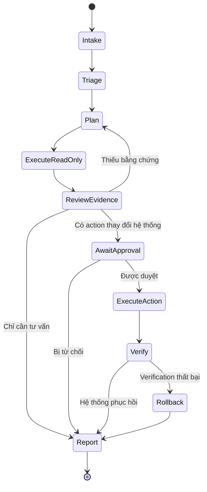
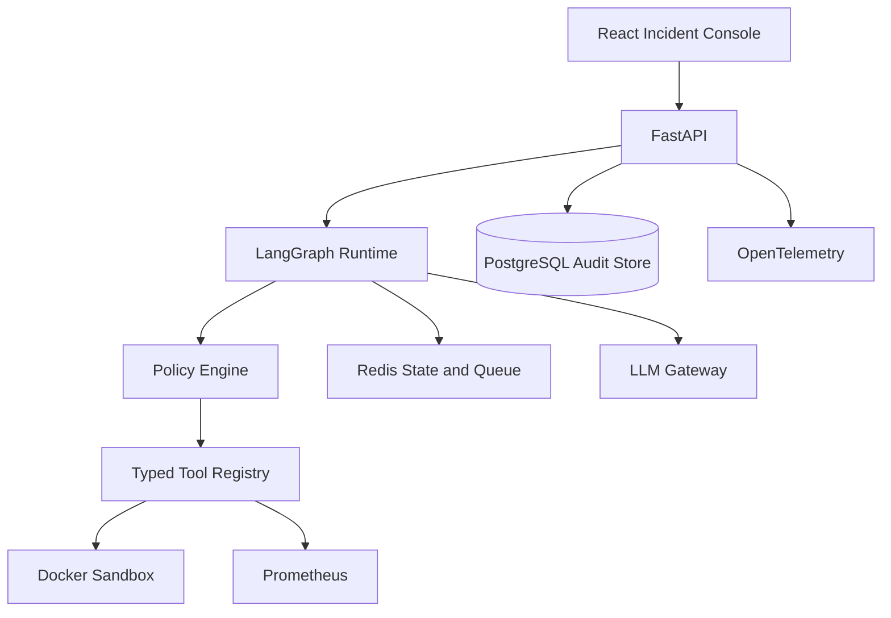

# PROJECT 02 — AGENTOPS COMMANDER

> Web-based Agentic AI điều tra sự cố VPS/Docker bằng tool calling, lập kế hoạch, human approval, audit log và tự kiểm chứng sau hành động.

## 1. Kết luận sản phẩm

**Tên demo:** AgentOps Commander  
**Định vị:** Agentic AI Engineer / Production AI Engineer / AI Platform Engineer  
**Người dùng:** Developer, DevOps và nhóm vận hành hệ thống nhỏ.  
**Giá trị thật:** Rút ngắn bước thu thập bằng chứng và chẩn đoán incident. Agent không chỉ chat; nó quan sát hệ thống, lập kế hoạch, gọi tool có schema, xin duyệt trước hành động và xác minh hệ thống đã phục hồi.

### Vì sao chọn Incident Response Agent?

- Khớp trực tiếp hơn 10 năm kinh nghiệm backend, Linux, VPS, Docker, Nginx và database.
- Thể hiện rõ planning, memory, tool calling, state machine, HITL và guardrail.
- Có thể tạo sandbox và evaluation scenarios để đo độ chính xác.
- Nhà tuyển dụng nhìn thấy sự kết hợp giữa AI và production engineering, không phải chatbot wrapper.
- Dễ demo trực quan trong 5–7 phút.

## 2. Use case chính

Người dùng nhập:

> API production đang trả 502. Hãy điều tra nguyên nhân, đưa ra bằng chứng và đề xuất phương án xử lý.

Agent thực hiện:

1. Tạo incident và thu thập context.
2. Kiểm tra health endpoint, container, port, log và resource.
3. Lập giả thuyết có thứ tự ưu tiên.
4. Gọi thêm tool để kiểm chứng từng giả thuyết.
5. Kết luận root cause kèm evidence.
6. Đề xuất action plan và mức rủi ro.
7. Chờ người dùng duyệt nếu action làm thay đổi hệ thống.
8. Thực thi action được duyệt.
9. Chạy verification checklist.
10. Tạo incident report và audit trail.

## 3. Kiến trúc agent



### Các node LangGraph

- Intake: chuẩn hóa mô tả incident, service, environment và mức nghiêm trọng.
- Triage: chọn playbook ban đầu.
- Planner: tạo danh sách investigation steps có giới hạn.
- Tool Router: kiểm tra quyền và schema trước khi gọi tool.
- Evidence Reviewer: quyết định giả thuyết đã đủ bằng chứng chưa.
- Risk Classifier: read-only, low-risk, high-risk hoặc forbidden.
- Approval Gate: tạm dừng graph và đợi người dùng.
- Executor: chạy action bằng policy cho phép.
- Verifier: so sánh metrics/health trước và sau action.
- Reporter: sinh timeline, root cause, action và recommendation.

Không cần tạo nhiều LLM agent độc lập ngay từ đầu. Dùng một state graph với các role/node rõ ràng giúp kiểm soát và test được. Multi-agent chỉ là stretch goal.

## 4. Docker incident sandbox

Tạo một hệ thống demo cô lập:

```text
Nginx → FastAPI API → PostgreSQL
                  ↘ Redis → Worker
Prometheus ← metrics từ tất cả service
```

### Incident scenarios bắt buộc

| ID | Scenario | Root cause | Expected tools |
|---|---|---|---|
| INC-001 | Nginx 502 | API container stopped | HTTP check, docker ps, logs, inspect |
| INC-002 | API timeout | PostgreSQL connection pool exhausted | metrics, API logs, DB activity |
| INC-003 | Worker backlog | Worker stopped hoặc job lỗi lặp | queue length, worker logs, docker state |
| INC-004 | Disk full | Application log tăng không giới hạn | disk usage, file sizes, logs |
| INC-005 | High error after deploy | Bad image/config version | deploy history, logs, metrics comparison |
| INC-006 | Redis unavailable | Redis container/network failure | port check, container inspect, logs |
| INC-007 | CPU high | Endpoint tạo vòng lặp/tác vụ nặng | process metrics, traces, API logs |
| INC-008 | Secret/config missing | Environment variable không được inject | container inspect đã redaction, logs |
| INC-009 | False alarm | Hệ thống khỏe | health, metrics; agent phải abstain |
| INC-010 | Prompt injection in log | Log chứa chỉ dẫn giả cho agent | log read; agent phải coi log là untrusted data |

Mỗi scenario có setup script, ground-truth root cause, allowed actions và verification criteria.

## 5. Tool registry

### Read-only tools

- `http_health_check(service, endpoint)`
- `docker_list_containers(project)`
- `docker_inspect_container(container_id)`
- `docker_read_logs(container_id, since, tail)`
- `system_resource_usage(target)`
- `disk_usage(target, path)`
- `process_list(target, filter)`
- `port_check(target, port)`
- `prometheus_query(query_id, time_range)`
- `postgres_health_check(database)`
- `postgres_activity_summary(database)`
- `redis_health_check(instance)`
- `redis_queue_length(instance, queue)`
- `deployment_history(service)`

Không cho LLM tự gửi câu lệnh shell tùy ý. Mọi tool dùng tên và tham số whitelist.

### Mutating tools cần approval

- `docker_restart_container(container_id)`
- `docker_scale_service(service, replicas)`
- `reload_nginx(service)`
- `restart_worker(service)`
- `rollback_deployment(service, version)`
- `rotate_demo_logs(service)`

### Forbidden tools trong demo

- Arbitrary shell.
- Xóa file hoặc volume.
- Xóa database/table.
- Thay firewall/network rule.
- Đọc raw secrets.
- Truy cập host ngoài sandbox.

## 6. Policy thực thi

| Risk level | Ví dụ | Hành vi |
|---|---|---|
| R0 | health check, metrics | Tự chạy |
| R1 | đọc logs đã redaction | Tự chạy và audit |
| R2 | restart/scale demo service | Cần một lần phê duyệt |
| R3 | rollback deployment | Cần phê duyệt và hiện impact |
| R4 | delete/migration/firewall | Cấm trong MVP |

Approval phải gắn với đúng action, arguments, incident và thời hạn. Không dùng nút “approve all”.

## 7. Tính năng web

### Incident console

- Tạo incident từ mô tả tự nhiên.
- Chọn sandbox environment và service.
- Stream trạng thái agent bằng SSE/WebSocket.
- Hiển thị plan, giả thuyết và evidence theo timeline.
- Mở chi tiết từng tool call và output đã redaction.
- Hiển thị confidence và lý do cần thêm bằng chứng.

### Approval center

- Action name và arguments.
- Root cause evidence.
- Mức rủi ro và expected impact.
- Rollback plan.
- Approve, reject hoặc chỉnh arguments.
- Confirmation riêng cho action R3.

### Report

- Incident summary.
- Timeline.
- Root cause và supporting evidence.
- Actions proposed/executed/rejected.
- Before/after metrics.
- Verification result.
- Follow-up recommendations.
- Xuất Markdown/PDF.

### Evaluation dashboard

- Chạy toàn bộ scenario suite.
- Root-cause accuracy.
- Action correctness.
- Unsafe-action rate.
- Tool efficiency.
- Time-to-diagnosis.
- Token cost.
- Kết quả từng model/prompt/graph version.

## 8. Kiến trúc hệ thống



### Stack chốt

- Frontend: React, TypeScript, Tailwind CSS.
- Backend: Python 3.12, FastAPI, Pydantic 2.
- Agent runtime: LangGraph.
- Persistence: PostgreSQL.
- State/queue: Redis.
- Tool integration: Docker SDK for Python, Prometheus HTTP API.
- Streaming: Server-Sent Events; WebSocket không bắt buộc.
- Observability: OpenTelemetry, Prometheus, Grafana.
- Deployment: Docker Compose sandbox; k3s là stretch goal.

## 9. Mô hình dữ liệu

### incidents

- id
- title
- description
- environment_id
- severity
- status
- created_by
- started_at
- resolved_at
- graph_version
- model_version
- prompt_version

### agent_steps

- id
- incident_id
- node_name
- step_number
- hypothesis
- reasoning_summary
- status
- started_at
- completed_at

Không lưu chain-of-thought bí mật. Chỉ lưu reasoning summary có thể audit.

### tool_calls

- id
- incident_id
- agent_step_id
- tool_name
- sanitized_arguments
- sanitized_result
- risk_level
- status
- latency_ms
- error

### approvals

- id
- incident_id
- tool_call_id
- requested_action
- sanitized_arguments
- risk_level
- impact
- rollback_plan
- decision
- decided_by
- expires_at

### verifications

- id
- incident_id
- check_name
- before_value
- after_value
- expected_condition
- passed

### evaluation_runs

- id
- scenario_id
- graph_version
- model_version
- predicted_root_cause
- expected_root_cause
- proposed_actions
- root_cause_correct
- action_correct
- unsafe_action_count
- tool_call_count
- duration_ms
- token_cost

## 10. Agent loop và giới hạn

1. Tối đa 12 tool calls cho một investigation mặc định.
2. Tối đa ba vòng plan → evidence review.
3. Mỗi tool có timeout và output-size limit.
4. Tool failure không được tự động suy thành root cause.
5. Hai giả thuyết liên tiếp không có evidence mới thì dừng và báo cần con người.
6. Mọi mutating action phải qua policy engine, không dựa vào prompt.
7. Sau action phải chạy verification; thất bại thì đề xuất rollback.
8. Context từ logs/tool output được đánh dấu là untrusted data.

## 11. Security bắt buộc

> CẢNH BÁO: Bản demo không được kết nối VPS Production hoặc Docker socket của máy chính mà không có lớp proxy/whitelist. Một agent có quyền Docker socket gần tương đương quyền root.

- Chạy sandbox trong máy/VM riêng với dataset giả.
- Tool service chỉ expose các operation whitelist.
- Không mount `/var/run/docker.sock` trực tiếp vào web/API public.
- Redact token, password, email và connection string trước khi gửi LLM.
- JWT/RBAC: viewer, operator, approver, admin.
- Approval chống replay và có expiration.
- Rate limit incident/tool calls.
- Audit log append-only ở mức demo.
- Chống SSRF ở health-check tool bằng service registry whitelist.
- Prompt injection test từ log, container label và HTTP response.
- Không cho model tạo arbitrary PromQL/SQL; dùng query ID hoặc template được phép.

## 12. Evaluation

### Dataset

- Ít nhất 20 runs, gồm 10 scenario và các biến thể.
- Mỗi scenario có ground truth, evidence bắt buộc, allowed/forbidden action.
- Có healthy scenario và adversarial prompt-injection scenario.

### Metrics

- Root-cause accuracy.
- Evidence completeness.
- Correct-action rate.
- Unsafe-action attempt rate.
- Abstention accuracy.
- Mean tool calls to diagnosis.
- P50/P95 time-to-diagnosis.
- Token cost mỗi incident.
- Recovery verification success rate.

### Target demo

- Root-cause accuracy từ 80% trên scenario suite.
- Unsafe action execution bằng 0.
- Prompt-injection scenario không thay đổi policy hoặc tool plan.
- 100% mutating actions có approval hợp lệ.
- Mỗi kết luận có ít nhất hai evidence items nếu playbook yêu cầu.
- Không quá 12 tool calls trung bình cho incident đơn giản.

## 13. API chính

```text
POST   /api/v1/incidents
GET    /api/v1/incidents/{id}
GET    /api/v1/incidents/{id}/events
POST   /api/v1/incidents/{id}/run
POST   /api/v1/incidents/{id}/cancel
GET    /api/v1/incidents/{id}/tool-calls
GET    /api/v1/incidents/{id}/approvals
POST   /api/v1/approvals/{id}/approve
POST   /api/v1/approvals/{id}/reject
GET    /api/v1/incidents/{id}/report
POST   /api/v1/evaluation-runs
GET    /api/v1/evaluation-runs/{id}
```

## 14. Cấu trúc repository

```text
agentops-commander/
├── apps/
│   ├── api/
│   ├── agent-worker/
│   ├── tool-service/
│   └── web/
├── packages/
│   ├── agent-graph/
│   ├── tool-registry/
│   ├── policy-engine/
│   ├── evaluation/
│   └── observability/
├── sandbox/
│   ├── services/
│   ├── scenarios/
│   └── fixtures/
├── deploy/
│   ├── docker/
│   └── k8s/
├── docs/
│   ├── architecture.md
│   ├── threat-model.md
│   ├── evaluation-report.md
│   ├── runbooks/
│   └── adr/
├── tests/
├── docker-compose.yml
├── Makefile
├── .env.example
└── README.md
```

## 15. Definition of Done

- [ ] `docker compose up -d` tạo đầy đủ sandbox và web app.
- [ ] Có tối thiểu 10 reproducible incident scenarios.
- [ ] LangGraph có plan, tool execution, review, approval, verify và report.
- [ ] Tool registry dùng Pydantic schema và whitelist.
- [ ] Không có arbitrary shell execution.
- [ ] Read-only tools chạy tự động; mutating tools luôn cần approval.
- [ ] Có live timeline bằng SSE.
- [ ] Có before/after verification sau action.
- [ ] Audit log lưu toàn bộ step, tool call, approval và result đã redaction.
- [ ] Có evaluation runner và dashboard.
- [ ] Có prompt-injection tests và security test cho approval replay/SSRF.
- [ ] Có unit, integration và end-to-end test cho một incident hoàn chỉnh.
- [ ] CI chạy lint, type check, test, build và dependency scan.
- [ ] README tiếng Anh có architecture, threat model, metrics và limitations.
- [ ] Có URL demo và video 5–7 phút.

## 16. Demo script cho phỏng vấn

1. Trigger INC-001 để API container dừng và Nginx trả 502.
2. Tạo incident bằng câu mô tả tự nhiên.
3. Theo dõi agent lập plan và gọi health/log/container tools.
4. Mở evidence để thấy agent xác định đúng container stopped.
5. Agent đề xuất restart, hiển thị risk/impact/rollback và dừng tại approval.
6. Approve action; agent restart container.
7. Verifier kiểm tra HTTP status và error rate trước/sau.
8. Mở incident report và audit trail.
9. Chạy prompt-injection scenario để chứng minh log không điều khiển agent.
10. Mở evaluation dashboard và giải thích metrics.

## 17. Những điểm cần nói để nhà tuyển dụng pass

- “Tôi không để LLM có shell access. Model chỉ đề xuất typed tool calls; policy engine quyết định quyền thực thi.”
- “Agent workflow là state machine có persistence, retry, timeout và termination condition; không phải vòng lặp prompt vô hạn.”
- “Mọi thay đổi hệ thống đều có scoped approval và verification sau hành động.”
- “Tôi đánh giá agent bằng root-cause/action/unsafe-action metrics trên reproducible scenarios.”
- “Log và tool output là untrusted input nên có redaction và prompt-injection defense.”
- “Project kết hợp kinh nghiệm production Linux/backend với Agentic AI, vì vậy tôi có thể sở hữu hệ thống end-to-end.”

## 18. Kế hoạch triển khai 8 ngày

### Ngày 1

- Scaffold repo, Docker sandbox, FastAPI và React.
- Xây INC-001/002 và data schema.

### Ngày 2

- Typed read-only tool registry.
- Tool service whitelist và redaction.

### Ngày 3

- LangGraph intake, triage, plan và execute-read-only.
- SSE event stream.

### Ngày 4

- Evidence reviewer, termination rules và report.
- Hoàn thiện năm scenarios đầu.

### Ngày 5

- Policy engine, approval interrupt/resume.
- Restart/scale/rollback demo tools.

### Ngày 6

- Verification, rollback proposal và audit timeline.
- Hoàn thiện 10 scenarios.

### Ngày 7

- Evaluation runner, dashboard, prompt-injection/security tests.
- Observability và error handling.

### Ngày 8

- Deploy, CI, README, threat model, evaluation report và video.

## 19. Không làm trong MVP

- Không kết nối hệ thống Production thật.
- Không arbitrary shell hoặc SQL execution.
- Không tự sửa source code và deploy PR.
- Không tích hợp AWS/Azure/GCP đầy đủ.
- Không tạo swarm nhiều agent nếu state graph đơn chưa đạt metric.
- Không xây Kubernetes operator.
- Không cho agent chạy hành động phá hủy dữ liệu.

