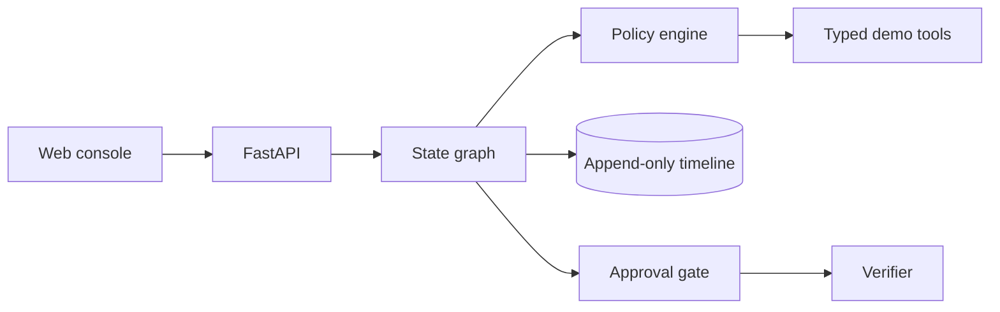

# Architecture

The graph is intentionally deterministic in this MVP: each scenario is a reproducible playbook and evidence fixture. This gives security tests a stable oracle. The `AgentEngine` is the graph boundary; planner and evidence-review nodes can later become LangGraph nodes using an LLM gateway, while the policy and execution boundary remains deterministic.

Each run is capped by the fixture plan (at most four calls, below the global twelve-call budget). A tool failure cannot imply a root cause. Reports store short, auditable summaries rather than hidden chain-of-thought. Timeline records, calls, approvals, and verification are persisted independently.

The local store is SQLite for a one-command demo. PostgreSQL/Redis are included in Compose to demonstrate deployment topology, but switching repository and queue implementations is future work.

